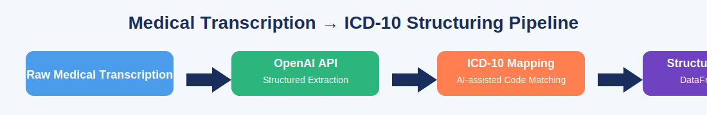

<p align="center">
  
</p>


# Organizing Medical Transcriptions with the OpenAI API

[](https://www.python.org/)
[](https://platform.openai.com/)
[](https://streamlit.io/)
[](https://www.docker.com/)
[](./LICENSE)
[](https://github.com/Johnnysnipes90)

By leveraging AI, unstructured natural language can be processed into organized data. This can reduce administrative tasks for healthcare professionals, freeing more time for direct patient care. In this project, I help the medical team automate the extraction and interpretation of vital information from their transcripts using the OpenAI API.

---

# Medical Transcription → ICD-10 Structuring Pipeline

Healthcare professionals spend hours daily extracting structured data from messy, natural-language medical transcripts.  
This project automates that workflow using the **OpenAI API**, producing structured key fields:

- Patient **age**
- Recommended **treatment** or procedure
- **Medical specialty**
- Automatically matched **ICD-10 code**

All wrapped in a clean, modular, production-ready pipeline suitable for machine learning engineers, data engineers, and AI research roles.

---

# ✨ Key Features

- ✅ Modular architecture (industry-standard `src/` layout)  
- ✅ OpenAI function calling for structured extraction  
- ✅ Automated ICD-10 code inference using LLMs  
- ✅ CLI Tool → `python -m medical_transcription_icd …`  
- ✅ Streamlit App for interactive processing  
- ✅ Docker containerization  
- ✅ Mocked unit tests (no real API calls in CI)  
- ✅ Jupyter Notebook demo  
- ✅ Extremely professional GitHub-ready project structure  

---

# ⚙️ Installation

### 1️⃣ Clone the repository

```bash
git clone https://github.com/your-username/medical-transcription-icd.git
cd medical-transcription-icd
```

### 2️⃣ Install dependencies
```bash
pip install -r requirements.txt
```

### 3️⃣ Set your OpenAI API key
```bash
# macOS/Linux
export OPENAI_API_KEY=your_key_here

# Windows
setx OPENAI_API_KEY "your_key_here"
```

# 📘 Usage Examples
✔ Python Usage
from medical_transcription_icd.utils import load_transcriptions
from medical_transcription_icd.process import process_transcriptions

df = load_transcriptions("data/transcriptions.csv")
df_structured = process_transcriptions(df)

print(df_structured.head())


# ✔ Streamlit App
Launch the interactive app:
```bash
streamlit run streamlit_app.py
```

# 🐳 Docker Usage
Build Docker image
```bash
docker compose build
```
---

```
🧰 Project Structure
medical-transcription-icd/
├─ data/                      # local CSV storage (ignored by Git)
├─ notebooks/
│  └─ example.ipynb           # Demonstration notebook
├─ src/
│  └─ medical_transcription_icd/
│     ├─ __init__.py
│     ├─ client.py            # OpenAI client init
│     ├─ extract.py           # Function-calling extraction logic
│     ├─ icd.py               # ICD-10 mapping logic
│     ├─ process.py           # Full pipeline
│     └─ utils.py             # Helpers/loaders
├─ tests/
│  ├─ test_extract.py
│  ├─ test_icd.py
│  └─ test_process_mocked.py  # Mocked OpenAI responses
├─ streamlit_app.py           # Web UI
├─ requirements.txt
├─ Dockerfile
├─ docker-compose.yml
├─ .pre-commit-config.yaml
├─ LICENSE
├─ README.md
└─ pyproject.toml / setup.cfg
```